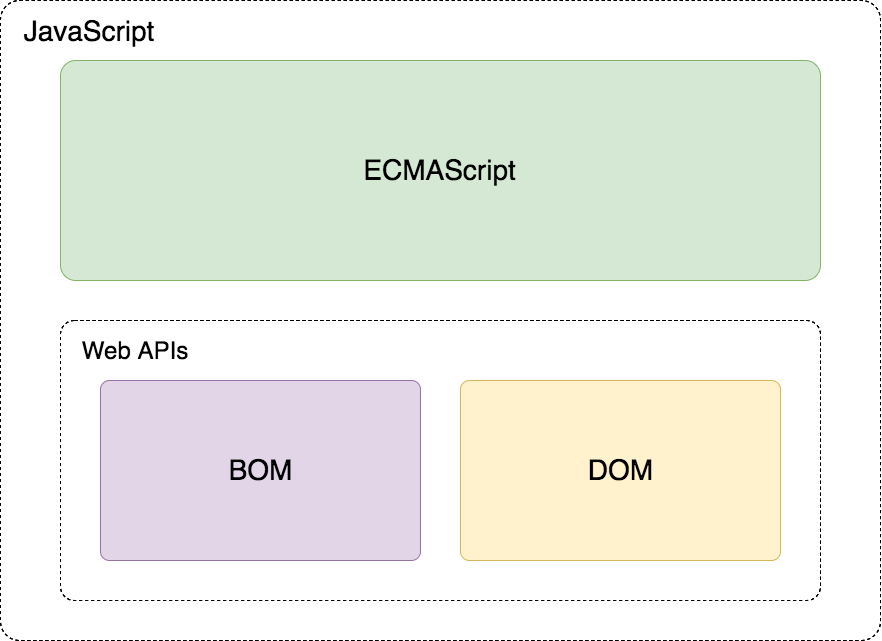
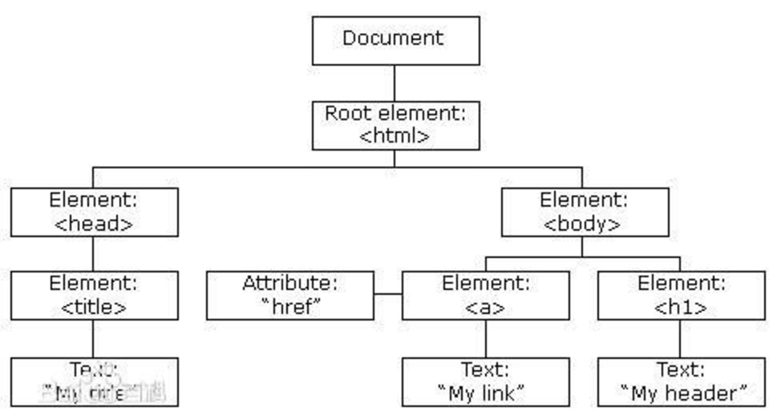

---
学习目标:
  - 掌握API和Web API的概念
  - 掌握常见浏览器提供的API的调用方式
  - 能通过Web API开发常见的页面交互功能
  - 能够利用搜索引擎解决问题
typora-copy-images-to: media
---

# Web API

## Web API介绍

### API的概念

API（Application Programming Interface,应用程序编程接口）是一些预先定义的函数，目的是提供应用程序与开发人员基于某软件或硬件得以访问一组例程的能力，而又无需访问源码，或理解内部工作机制的细节。

- 任何开发语言都有自己的API
- API的特征输入和输出(I/O)
  - var max =  Math.max(1, 2, 3);
- API的使用方法(console.log('adf'))

### Web  API的概念

浏览器提供的一套操作浏览器功能和页面元素的API(BOM和DOM)

此处的Web API特指浏览器提供的API(一组方法)，Web API在后面的课程中有其它含义


### 掌握常见浏览器提供的API的调用方式
[MDN-Web API](https://developer.mozilla.org/zh-CN/docs/Web/API)

### JavaScript的组成



#### ECMAScript - JavaScript的核心

定义了JavaScript 的语法规范

JavaScript的核心，描述了语言的基本语法和数据类型，ECMAScript是一套标准，定义了一种语言的标准与具体实现无关

#### BOM - 浏览器对象模型

一套操作浏览器功能的API

通过BOM可以操作浏览器窗口，比如：弹出框、控制浏览器跳转、获取分辨率等 

#### DOM - 文档对象模型

一套操作页面元素的API

DOM可以把HTML看做是文档树，通过DOM提供的API可以对树上的节点进行操作

## DOM

### DOM的概念 

文档对象模型（Document Object Model，简称DOM），是[W3C](https://baike.baidu.com/item/W3C)组织推荐的处理[可扩展标记语言](https://baike.baidu.com/item/%E5%8F%AF%E6%89%A9%E5%B1%95%E7%BD%AE%E6%A0%87%E8%AF%AD%E8%A8%80)的标准[编程接口](https://baike.baidu.com/item/%E7%BC%96%E7%A8%8B%E6%8E%A5%E5%8F%A3)。它是一种与平台和语言无关的[应用程序接口](https://baike.baidu.com/item/%E5%BA%94%E7%94%A8%E7%A8%8B%E5%BA%8F%E6%8E%A5%E5%8F%A3)(API),它可以动态地访问程序和脚本，更新其内容、结构和[www](https://baike.baidu.com/item/www/109924)文档的风格(目前，HTML和XML文档是通过说明部分定义的)。文档可以进一步被处理，处理的结果可以加入到当前的页面。[DOM](https://baike.baidu.com/item/DOM/50288)是一种基于树的[API](https://baike.baidu.com/item/API/10154)文档，它要求在处理过程中整个文档都表示在[存储器](https://baike.baidu.com/item/%E5%AD%98%E5%82%A8%E5%99%A8)中。

DOM又称为文档树模型



- 文档：一个网页可以称为文档
- 节点：网页中的所有内容都是节点（标签、属性、文本、注释等）
- 元素：网页中的标签
- 属性：标签的属性

### DOM经常进行的操作

- 获取元素
- 对元素进行操作(设置其属性或调用其方法)
- 动态创建元素
- 事件(什么时机做相应的操作)

## 获取页面元素

### 为什么要获取页面元素

例如：我们想要操作页面上的某部分(显示/隐藏，动画)，需要先获取到该部分对应的元素，才进行后续操作

### 根据id获取元素

```javascript
var div = document.getElementById('main');
console.log(div);

// 获取到的数据类型 HTMLDivElement，对象都是有类型的
```

注意：由于id名具有唯一性，部分浏览器支持直接使用id名访问元素，但不是标准方式，不推荐使用。

### 根据标签名获取元素

```javascript
var divs = document.getElementsByTagName('div');
for (var i = 0; i < divs.length; i++) {
  var div = divs[i];
  console.log(div);
} 
```

### 根据name获取元素*

```javascript
var inputs = document.getElementsByName('hobby');
for (var i = 0; i < inputs.length; i++) {
  var input = inputs[i];
  console.log(input);
}
```

### 根据类名获取元素*

```javascript
var mains = document.getElementsByClassName('main');
for (var i = 0; i < mains.length; i++) {
  var main = mains[i];
  console.log(main);
}
```

### 根据选择器获取元素*

```javascript
var text = document.querySelector('#text');
console.log(text);

var boxes = document.querySelectorAll('.box');
for (var i = 0; i < boxes.length; i++) {
  var box = boxes[i];
  console.log(box);
}
```

- 总结

```
掌握
	getElementById()
	getElementsByTagName()
了解
	getElementsByName()
	getElementsByClassName()
	querySelector()
	querySelectorAll()
```

### 关系节点

```javascript

let child = document.getElementById("child");
child.parentNode; // 父节点
child.nextSibling; // 下一个兄弟节点(所有的节点,文本,属性)
child.nextElementSibling; // 写一个兄弟元素节点
child.nextElementSibling || child.nextSibling;
child.preElementSibling; // 上一个兄弟节点

child.firstElementChild;  // 第一个子元素节点
child.lastElementChild; // 最后一个元素节点
child.childNodes; // 所有子节点(属性,文本)
child.children; // 所有元素子节点
```

```javascript
// 通过 childNodes 来获取元素节点.
let child = document.getElementById('child');
let allChilds = child.childNodes;
let all = [];
allchilds.forEach(function(value,key,parent){
    // nodetype =1 为 元素节点
    if(value.nodeType == 1){
        all.push(value);
    }
})
// 
```


## 事件

事件：触发-响应机制

### 事件三要素

- 事件源:触发(被)事件的元素
- 事件名称: click 点击事件
- 事件处理程序:事件触发后要执行的代码(函数形式)

### 事件的基本使用

```javascript
var box = document.getElementById('box');
box.onclick = function() {
  console.log('代码会在box被点击后执行');  
};
```

### 案例
- 点击按钮弹出提示框
- 点击按钮切换图片

## 属性操作

### 非表单元素的属性

href、title、id、src、className

```javascript
var link = document.getElementById('link');
console.log(link.href);
console.log(link.title);

var pic = document.getElementById('pic');
console.log(pic.src);
```

案例：

​	点击按钮显示隐藏div

​	美女相册

- innerHTML和innerText

```javascript
var box = document.getElementById('box');
box.innerHTML = '我是文本<p>我会生成为标签</p>';
console.log(box.innerHTML);
box.innerText = '我是文本<p>我不会生成为标签</p>';
console.log(box.innerText);
```
- HTML转义符

```
"		&quot;
'		&apos;
&		&amp;
<		&lt;   // less than  小于
>		&gt;   // greater than  大于
空格	   &nbsp;
大空格	  &emsp;
©		&copy;
```

- innerHTML和innerText的区别

- innerText的兼容性处理


### 表单元素属性

- value 用于大部分表单元素的内容获取(option除外)
- type 可以获取input标签的类型(输入框或复选框等)
- disabled 禁用属性
- checked 复选框选中属性
- selected 下拉菜单选中属性

### 案例

- 点击按钮禁用文本框
- 给文本框赋值，获取文本框的值
- 检测用户名是否是3-6位，密码是否是6-8位，如果不满足要求高亮显示文本框
- 设置下拉框中的选中项
- 搜索文本框
- 全选反选

### 自定义属性操作

- getAttribute() 获取标签行内属性
- setAttribute() 设置标签行内属性
- removeAttribute() 移除标签行内属性
- 与element.属性的区别: 上述三个方法用于获取任意的行内属性。

### 样式操作

- 使用style方式设置的样式显示在标签行内
```javascript
var box = document.getElementById('box');
box.style.width = '100px';
box.style.height = '100px';
box.style.backgroundColor = 'red';
```

- 注意

  通过样式属性设置宽高、位置的属性类型是字符串，需要加上px

### 类名操作

- 修改标签的className属性相当于直接修改标签的类名
```javascript
var box = document.getElementById('box');
box.className = 'show';
```

### 案例

- 开关灯
- 点击按钮变色
- 图片切换二维码案例
- 当前输入的文本框高亮显示
- 点击按钮改变div的大小和位置
- 列表隔行变色、高亮显示
- 京东商品展示
- tab选项卡切换

## 创建元素的三种方式

### document.write()

```javascript
document.write('新设置的内容<p>标签也可以生成</p>');
```

### innerHTML

```javascript
var box = document.getElementById('box');
box.innerHTML = '新内容<p>新标签</p>';
```

### document.createElement()

```javascript
var div = document.createElement('div'); // 创建节点
document.body.appendChild(div); // 追加到 哪个几点里

```

### 性能问题

- innerHTML方法由于会对字符串进行解析，需要避免在循环内多次使用。
- 可以借助字符串或数组的方式进行替换，再设置给innerHTML
- 优化后与document.createElement性能相近

## 节点操作(增删改查)

```javascript
var body = document.body;
var div = document.createElement('div');
body.appendChild(div);

var firstEle = body.children[0];
body.insertBefore(div, firstEle);

body.removeChild(firstEle);

var text = document.createElement('p');
body.replaceChild(text, div);
```

案例：

​	权限选择

### 节点属性

### 模拟文档树结构


```javascript
function Element(option) {
  this.id = option.id || '';
  this.nodeName = option.nodeName || '';
  this.nodeValue = option.nodeValue || '';
  this.nodeType = 1;
  this.children = option.children || [];
}

var doc = new Element({
  nodeName: 'html'
});
var head = new Element({
  nodeName: 'head'
});
var body = new Element({
  nodeName: 'body'
})
doc.children.push(head);
doc.children.push(body);

var div = new Element({
  nodeName: 'div',
  nodeValue: 'haha',
});

var p = new Element({
  nodeName: 'p',
  nodeValue: '段落'
})
body.children.push(div);
body.children.push(p);

function getChildren(ele) {
  for(var i = 0; i < ele.children.length; i++) {
    var child = ele.children[i];
    console.log(child.nodeName);
    getChildren(child);
  }
}
getChildren(doc);
```


### 节点层级

重点讲父子属性，兄弟属性画图讲解 

```javascript
var box = document.getElementById('box');
console.log(box.parentNode);
console.log(box.childNodes);
console.log(box.children);
console.log(box.nextSibling);
console.log(box.previousSibling);
console.log(box.firstChild);
console.log(box.lastChild);
```

- 注意

  childNodes和children的区别，childNodes获取的是子节点，children获取的是子元素

  nextSibling和previousSibling获取的是节点，获取元素对应的属性是nextElementSibling和previousElementSibling获取的是元素

  ​	nextElementSibling和previousElementSibling有兼容性问题，IE9以后才支持

- 总结

```
节点操作，方法
	appendChild()   //追加节点
	insertBefore()  // createElement('img').insertBefore()
	removeChild()
	replaceChild()
  createTextNode() // 创建文本节点。
	
	cloneNode()  //克隆 一层 节点
	cloneNode(ture) // 深克隆
节点层次，属性
	parentNode
	childNodes
	children
	nextSibling/previousSibling
	firstChild/lastChild
```

## 事件详解


### 注册/移除事件的三种方式

```javascript
var box = document.getElementById('box');
box.onclick = function () {
  console.log('点击后执行');
};
box.onclick = null;

box.addEventListener('click', eventCode, false);
box.removeEventListener('click', eventCode, false);

box.attachEvent('onclick', eventCode);
box.detachEvent('onclick', eventCode);

function eventCode() {
  console.log('点击后执行');
}
```

### 兼容代码

```javascript
function addEventListener(element, type, fn) {
  if (element.addEventListener) {
    element.addEventListener(type, fn, false);
  } else if (element.attachEvent){
    element.attachEvent('on' + type,fn);
  } else {
    element['on'+type] = fn;
  }
}

function removeEventListener(element, type, fn) {
  if (element.removeEventListener) {
    element.removeEventListener(type, fn, false);
  } else if (element.detachEvent) {
    element.detachEvent('on' + type, fn);
  } else {
    element['on'+type] = null;
  }
}
```

### 事件的三个阶段

1. 捕获阶段

2. 当前目标阶段

3. 冒泡阶段

   事件对象.eventPhase属性可以查看事件触发时所处的阶段

### 事件对象的属性和方法

- event.type 获取事件类型
- clientX/clientY     所有浏览器都支持，可视窗口，当前鼠标位置。
- pageX/pageY       IE8以前不支持，页面位置
- event.target || event.srcElement 用于获取触发事件的元素
- event.preventDefault() 取消默认行为
- offsetX / offsetY 

**盒子拖坠**
```javascript
// 1)   left =  pageX - offsetX
// 2)   left = pageX - clientX + (this.offsetWidth)/2
this.style.left = left;
this.style.Top = right;
```


#### 案例

- 跟着鼠标飞的天使
- 鼠标点哪图片飞到哪里
- 获取鼠标在div内的坐标

### 阻止事件传播的方式

- 标准方式 event.stopPropagation();
- IE低版本 event.cancelBubble = true; 标准中已废弃

### 常用的鼠标和键盘事件

- onmouseup 鼠标按键放开时触发
- onmousedown 鼠标按键按下触发
- onmousemove 鼠标移动触发
- onkeyup 键盘按键按下触发
- onkeydown 键盘按键抬起触发
  - onkedown 获取的是上一个按下的键value 值。

## BOM

### BOM的概念

BOM(Browser Object Model) 是指浏览器对象模型，浏览器对象模型提供了独立于内容的、可以与浏览器窗口进行互动的对象结构。BOM由多个对象组成，其中代表浏览器窗口的Window对象是BOM的顶层对象，其他对象都是该对象的子对象。

我们在浏览器中的一些操作都可以使用BOM的方式进行编程处理，

比如：刷新浏览器、后退、前进、在浏览器中输入URL等

### BOM的顶级对象window

window是浏览器的顶级对象，当调用window下的属性和方法时，可以省略window
注意：window下一个特殊的属性 window.name

### 对话框

- alert()
- prompt()
- confirm()

### 页面加载事件

- onload

```javascript
window.onload = function () {
  // 当页面加载完成执行
  // 当页面完全加载所有内容（包括图像、脚本文件、CSS 文件等）执行
}
```

- onunload

```javascript
window.onunload = function () {
  // 当用户退出页面时执行
}
```

### 定时器

#### setTimeout()和clearTimeout()

在指定的毫秒数到达之后执行指定的函数，只执行一次

```javascript
// 创建一个定时器，1000毫秒后执行，返回定时器的标示
var timerId = setTimeout(function () {
  console.log('Hello World');
}, 1000);

// 取消定时器的执行
clearTimeout(timerId);
```

#### setInterval()和clearInterval()

定时调用的函数，可以按照给定的时间(单位毫秒)周期调用函数

```javascript
// 创建一个定时器，每隔1秒调用一次
var timerId = setInterval(function () {
  var date = new Date();
  console.log(date.toLocaleTimeString());
}, 1000);

// 取消定时器的执行
clearInterval(timerId);
```

### location对象

location对象是window对象下的一个属性，时候的时候可以省略window对象

location可以获取或者设置浏览器地址栏的URL

#### URL

统一资源定位符 (Uniform Resource Locator, URL)

- URL的组成

```
scheme://host:port/path?query#fragment
scheme:通信协议
	常用的http,ftp,maito等
host:主机
	服务器(计算机)域名系统 (DNS) 主机名或 IP 地址。
port:端口号
	整数，可选，省略时使用方案的默认端口，如http的默认端口为80。
path:路径
	由零或多个'/'符号隔开的字符串，一般用来表示主机上的一个目录或文件地址。
query:查询
	可选，用于给动态网页传递参数，可有多个参数，用'&'符号隔开，每个参数的名和值用'='符号隔开。例如：name=zs
fragment:信息片断
	字符串，锚点.
```

#### location有哪些成员？专门管 url 的事。

- 使用chrome的控制台查看

- 查MDN

  [MDN](https://developer.mozilla.org/zh-CN/)

- 成员

  - assign()/reload()/replace()
  - hash/host/hostname/search/href……

#### 案例

解析URL中的query，并返回对象的形式

```javascript
function getQuery(queryStr) {
  var query = {};
  if (queryStr.indexOf('?') > -1) {
    var index = queryStr.indexOf('?');
    queryStr = queryStr.substr(index + 1);
    var array = queryStr.split('&');
    for (var i = 0; i < array.length; i++) {
      var tmpArr = array[i].split('=');
      if (tmpArr.length === 2) {
        query[tmpArr[0]] = tmpArr[1];
      }
    }
  }
  return query;
}
console.log(getQuery(location.search));
console.log(getQuery(location.href));
```

### history对象

- back()
- forward()
- go()

### navigator对象

- userAgent

通过userAgent可以判断用户浏览器的类型

- platform

通过platform可以判断浏览器所在的系统平台类型.

## 特效

### 偏移量

- offsetParent用于获取定位的父级元素
- offsetParent和parentNode的区别

```javascript
var box = document.getElementById('box');
console.log(box.offsetParent); // 有定位的父盒子， 是盒子
console.log(box.offsetLeft);// 左偏移量
console.log(box.offsetTop); // Top 偏移量
console.log(box.offsetWidth); // 整个盒子的 宽度
console.log(box.offsetHeight);
```


### 客户区大小

```javascript
var box = document.getElementById('box');
console.log(box.clientLeft);// 盒子的 left boreder宽度
console.log(box.clientTop);// 盒子的 top border 宽度
console.log(box.clientWidth); // css 所设置的宽度
console.log(box.clientHeight); // css 所设置的高度
```


### 滚动偏移

```javascript
- document 的滚动
var box = document.getElementById('box');
console.log(box.scrollLeft); // 子盒的滚动条到父盒子顶部的距离
console.log(box.scrollTop); 
console.log(box.scrollWidth); // 
console.log(box.scrollHeight)

- window 的滚动
window.onscroll = function{
    console.log(document.body.scrollTop)
    window.pageYOffset = function //最新的适用
    document.compatMode -> back（怪异） css
    document.documentElement.scrollTop = 
}
    
兼容 : 拿到滚动条
	let scrolltop = window.pageYOffset || document.documentElement.scrollTop || document.body.scrollTop;

```


### 案例 

- 匀速动画函数
- 变速动画函数
- 回到顶部
- 无缝轮播图
- 模拟滚动条
- 拖拽案例
- 放大镜案例


## 附录

### 元素的类型


## 我的添加

- 整站下载工具  爬取整站  teleport ultra
- 仿战小工具


#### 三大家族
offsetwidth   offsetheight    border + padding + content
clientwidth  clientheight    padding + content 
srcollwidth  srcollheight   可滚动的宽度 与高度

offsetLeft   offsetTop    -> position: absolute; left = offsetLeft
clientLeft  clientTop   ->  border 边框的宽度 
srcollLeft  srcollTop   -> 滚动的长度 

clientLeft + clientWidth = offsetWidth

文字的获取
window.getSelection().toString()  标准浏览器
document.selection.createRange().text; ie

#### 当前浏览器可视区的宽度

window.innerWidth    最新浏览器
document.documentElement.clientWidth  标准浏览器
document.body.clientWidth    怪异浏览器

var keshi =  window.innerWidth || 							document.documentElement.clientWidth[offsetWidth]  || document.body.clientWidth；


#### window.onreset
- 当window 的窗口大小 被缩小 或放大时 就 触发
- 响应式 的 medio screen

#### 事件的传递装置 
- 冒泡  
- 捕获

#### 获取页内，引用样式 | 获取样式
obj.currentStyle[attr]; // 低版本的 获取当前渲染的样式
window.getComputeStyle(element[,pseudo])[attr];
  - pseudo 伪元素，如果有的化话
  - 样的属性


## 事件
> 在目标阶段的事件会触发该元素（即事件目标）上的所有监听器，而不在乎这个监听器到底在注册时》> useCapture 参数值是true还是false。

> 

<a href="https://www.w3.org/TR/DOM-Level-3-Events/#event-flow">事件流 查看文档</a>

> 我真正的了解事件的 顺序了， 首先： 触发事件时本身就是 父级先向下传递，
>  到target 子元素， 传递的过程称"捕获"，
> target 元素再把事件向上'冒泡'
> 与 `useCapture` : Boolean，是否先与子元素触发事件。 true 则先， false 则在后 来理解。

- `onclick` 同类事件会覆盖，而 addEventListener 则不会
- `addEventListener(EventName(type), callback[,useCapture])`
  - `useCapture` : Boolean，是否先与子元素触发事件。 true 则先， false 则 后
  - `callback(e)` : `e : { eventphase : 0,1,2,3 }` 事件阶段
  - 底层的累加叠加事件。"追加事件"
  - 目标阶段
  - 捕获阶段
  - 冒泡阶段

- `attachEvent("onclick",function)` (低版本做兼容性的 addEventListener)
  - 后绑定的先执行。

```javascript
function test(var a = function(){console.log()}){}
console.log(a)

(var a = function(){};)
console.log(a)

```

- mouseover : 当前盒子，或当前盒子的子盒子 ，都会触发,(事件冒泡)
- mouseout : 当前盒子，或当前盒子的子盒子 ，都会触发, (事件冒泡)
- mouseenter : 当前盒子
- mouseout : 当前盒子
- mousemove : 好东西， 移动 。
- mousedown : 按下时 1
- mouseup : 松开时  2
- click : 完成整个 点击过程。 3 点击事件最后触发。有 两三百毫秒的延迟。

- keydown, collback(e){ console.log(e.keyCode) }
- keypress
- keyup 
- e.keyCode 可以查看 键对应的 acsii 码表。

KeyboardEvent-》 keyCode
<a href="https://developer.mozilla.org/en-US/docs/Web/API/KeyboardEvent">KeyboardEvent 键盘对象</a>

- `scroll`  滚动事件 与 `srollTop` 等属性可以用
- `resize` 浏览器窗体改变是触发
- `hashchange` 锚链接改变时触发。**重** **虚拟dom**
  - -> location.hash 
  - 拿到 location.hash ,判断， 创建 innerHTML 虚拟DOM -> 单页面 操作。
- `contextmenu`  : 上下文菜单
  - `callback(e)` e.preventDefault(), -> 屏蔽浏览器的默认菜单。 prevent (阻止)
  - **右键点击时 触发，覆盖了浏览器本来的 右键菜单栏**
- `dblclick`  双击有间隔

- blur : 可以出来光标的才行。
- focus : 可以出来光标的才行。

- input 
- change

## 事件对象 Event
如
<a href="https://developer.mozilla.org/zh-CN/docs/Web/API/MouseEvent/MouseEvent">MouseEvent</a>

- 有 `MouseEvent` 
  - (继承于)UIEvent
  - (继承于) Event
- `button` 鼠标的那个按键按下的
- `clientX` `clientY` **页面可视区**的鼠标点击位置 
- `pageX` `pageY`  **整个页面 包含滚动的 scroll**
- `offsetX` `offsetY`  **鼠标距离当前元素原点的位置**
- `screenX` `screenY` **不知是浏览器， 是相对整个屏幕的距离**
- `shiftKey` `altKey` `ctrlKey` **是否按住了shift,alt,ctrl键来点击鼠标**

### 阻止事件冒泡,可以事件委托
- stopPropagation 阻止传播
  - cancelBubble (低版本)

### 事件委托
> 还未明白

本来事件的顺序是捕获-> 传到目标元素(事件) -> 目标元素再将(事件)往上冒泡
委托: 就是 在父元素中监听一次，通过 `target`找到目标事件`AT-TARGET`， 给他赋予动作
- target || srcElement
  - return Element(元素)

```javascript
// 大盒子(父盒子) parent
var parent = document.getElementById('parent');

parent.addEventListener('click',function(e){
  var target = e.target || e.srcElement;
  
  switch (target.id){
    case childoneId:
      ...
      break;
    case childtwoId:
      ...
      break;
  }
})

```